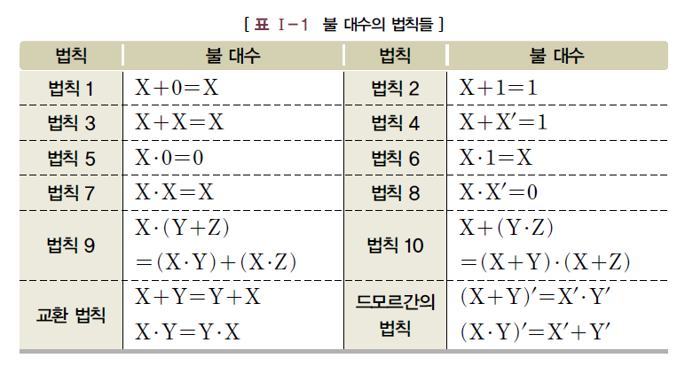
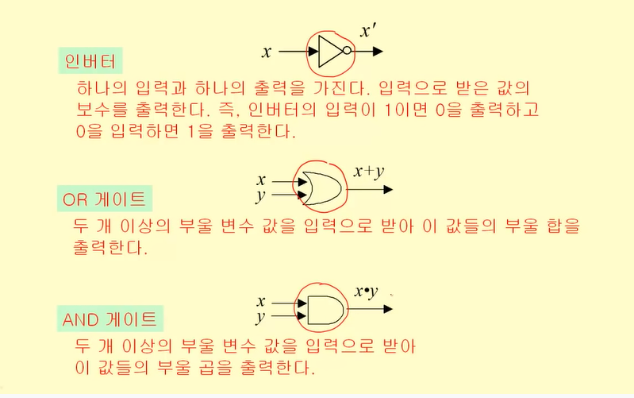

# 명제, 추론, 귀납, 부울대수

## 명제

참 혹은 거짓으로 판명할 수 있는 **선언적인 문장**

주어 + 술어로 구성

- 사실 명제 - 관찰, 측정, 실험

- 논리 명제 - 수학, 형식 명제, 컴퓨터에서 사용


### 복합명제

단순 명제의 조합

- 명제의 부정 negative
- 명제의곱 conjunction
- 명제의 합 disjunction (inclusive OR, exclusive OR)
- 조건명제 conditional
  - 일상언어 사용에서의 원인-결과, 가정-결론 논리 아님
  - 조건 명제 값 정의하는 진리표에 의해 결정됨
- 쌍조건 명제 biconditional
  - 명제 p와 q가 모두 참이거나 모두 거짓일 때 참
  - `p ⇒ q`에서 p가 참이고 q가 참이면 q는 p가 되기 위한 **필요조건**
  - `p ⇒ q`에서 p가 참, q참이면 p는 q이기 위한 **충분조건**
  - `p ⇒ q` 동시에 `q ⇒ p`면 **필요충분조건** (동치)


### 한정사

- `∀` 전체 한정 all
- `∃` 존재 한정 some

###  문장의 논리적 표현

```
예)
"이 클래스의 모든 학생은 C언어 인증 시험을 통화했다"

함수 C(x) : 학생 x는 C언어 인증 시험을 통과했다
x의 정의 구역: 이 클라스의 학생들

∀x (x ⇒ C(x))
```


## 추론, 연역과 귀납

### 추론

참으로 알고 있는 명제로부터 새로운 참인 명제 찾아내는 과정

>  논리 : 올바른 추론의 규칙


### 연역법 deduction

형식 논리의 담으과 같은 명제의 틀에 기반을 두고 있다

전제가 참이 아닐 경우 결론도 참이 아님

```
If P, then Q (P⇒Q)
P (P)
----
∴ Q (Q)
```

> 수학 이론은 연역법에 의해 만들어진 명제로 이뤄짐
>
> Axiom(공리, 가정), definition(정의), theorem(증명된 정리) → (Proof by deduction) → conclusion(정리, Lemma)


### 귀납법 induction

개별적인 사실을 말하는 명제들로부터 일반적인 결론을 도출

현실적으로 집합의 모든 원소에 대해서 참인 것을 밝힐 수 없음 → 확률적인 결론만 도출 가능


## 부울 대수와 논리 회로 설계

논리 회로 설계 문제

입출력 정의 > 부울 함수 > 부울식 > 부울식 최소화 > 논리회로

### 부울대수

**정의**

```
집합 S={0,1}에 대해 다음 세 가지 연산이 존재한다.
- 보수 complement : `로 표시
- 부울 합 boolean sum : + 혹은 OR 로 표시
- 부울 곱 boolean product : · 혹은 AND로 표시 (·는 생략 가능)

연산 우선순위 : 보수 >> 곱 >> 합
```

**정의** : 쌍대성 원리

```
부울 대수의 모든 항등 법칙에 대해 다음 2개 식이 쌍으로 존재한다.

x+0=x
x·1=x

이러한 쌍을 쌍대(dual)라 함
부울식으로 표현된 함수들 사이에 항등성이 유지되면 이들 쌍대도 항등성 유지
쌍대는 ·과 +를 교환하고, 0과 1을 교환해 구할 수 있음
```


### 부울 대수의 법칙




### 게이트와 부울 연산

전자장치의 입출력은 0 또는 1 → 전자회로 설계에 부울대수 사용 가능

> 게이트 : 회로의 기본요소




### 논리회로 설계

- 카르노 맵
  - 부울 함수의 간단한 논리합 형식을 찾아내는 방법