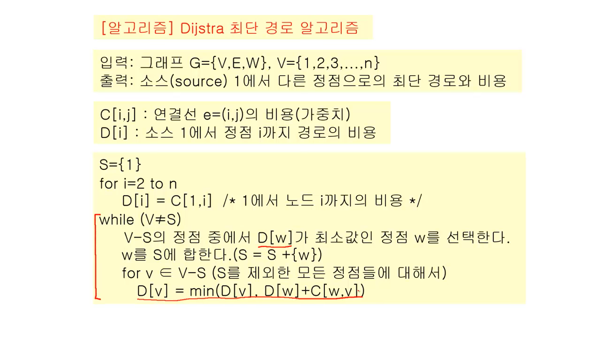
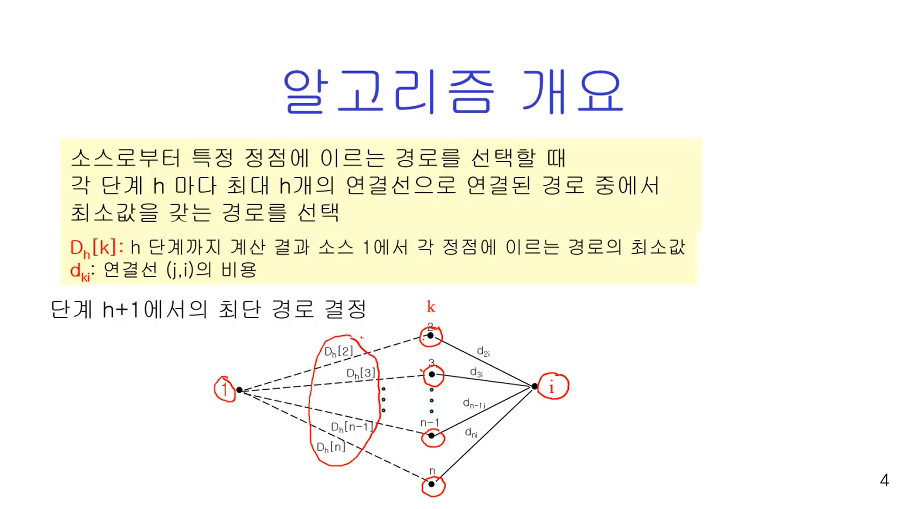
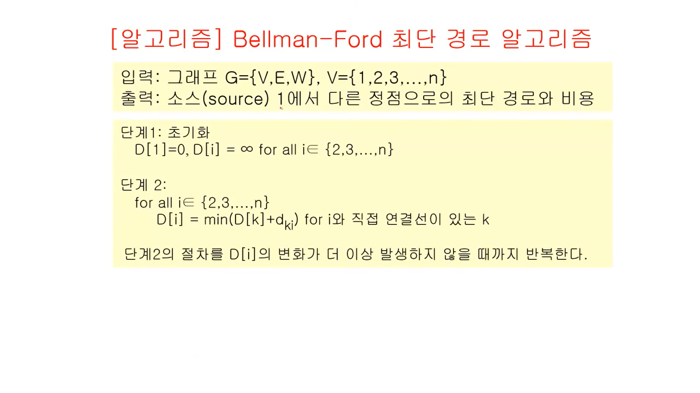
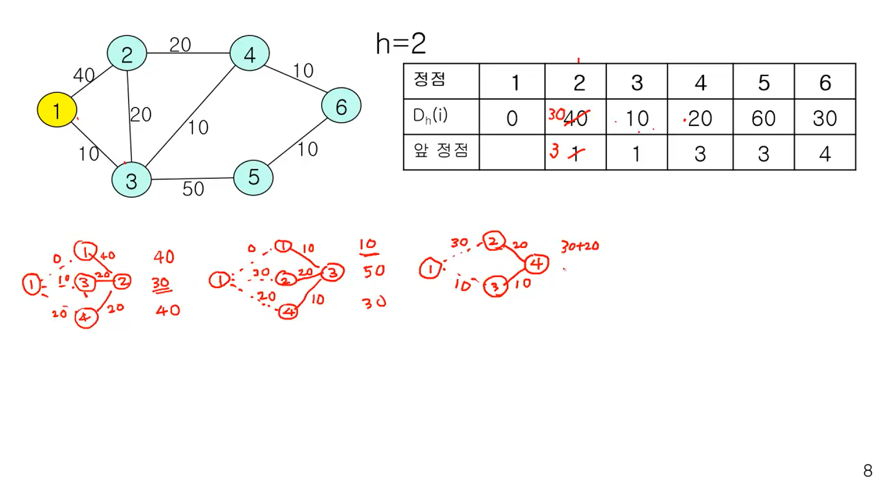

영상: https://www.youtube.com/playlist?list=PLD8rdlfZeJk6evHY9NsnBqXKrreNbTqFv


## 알고리즘

- 순서대로 정의된 절차 - 분명한 순서

- 명확성 - 명확하 정의, 실행 가능성

- 반드시 원하는 결과 나와야 - 동일한 입력값, 동일한 출력값

- 일정 시간 안에 실행돼야

### 구조

- 순차적 구조 sequential structure
- 분기 구조 branch
- 반복 구조 repetition
- 점프 구조 jump

### 알고리즘 기술 방법

- 플로우차트
- 프로그램 언어의 코드 - 프래그램 언어로 기술
- Pseudocode - 프로그램 언어 구조를 그대로 사용

### 알고리즘 검증

- 귀납법 - 몇가지 사례(입력값)에 대해 옳음을 보임


## 오일러 순환과 해밀턴 순환

### 오일러 순환

- 오일러 경로 - 그래프 G의 모든연결선을 한번만 방문하는 경로

- 오일러 순환 - 시작점과 끝점이 동일한 오일러 경로

- 오일러 그래프 - 오일러 순환이 존재하는 그래프

- 차수 - 정점 u에 접합된 연결선의 수 `deg(u)`

**정의** : 오일러 경로를 갖기 위한 필요충분조건

```
 2개 이상의 정점을 갖는 루프가 없는 연결 그래프에서 홀수 차수를 갖는 정점이 하나도 없거나 오직 두 개만 존재해야 한다
 모든 정점이 짝수 차수를 가지면 오일러 순환이 존재, 오일러 그래프다.
```

- n * (차수) <= n * (n-1) <= n^2
  - 알고리즘 복잡도 : O(n^2)

### 해밀턴 순환

- 해밀턴 경로 - 그래프 G에서 모든 정점을 정확히 한번만 지나는 경로
- 시작점과 끝점이 같은 해밀톤 경로

- 전수 조사 Exhastive search 필요
  - 알고리즘 복잡도 : O(x^n) (n: 정점의 수)

### 방문 판매원 문제

- 연결선에 비용 주어짐 weighted edge
- 일반적으로 완전 그래프
- 비용이 최소가 되는 해밀톤 순환 찾는 문제


## 기본 용어
**정리** : 모든 정점의 차수 합은 모든 연결선 수의 2배

### 기본용어

- 인접, 접합 - 임의의 연결선 e=(u,v) 대해 정점 u와 v는 서로 인접, e는 정점 u와 v에 접합

- 루프 - 두 끝점 같은 정점인 연결선

- 다중 연결선 - 두 정점 두 개 이상의 연결선

- 연결 - 두 정점 u와 v 사이 연결선 존재하면 두 정점은 연결됐다 함

- 길이 - 두 정점 경로를 구성하는 연결선 수

- 거리 - 두 정점 간 최단 경로의 길이

- 닫힌 경로 - 만약 경로 {v1, v2, ... , vn}에서 v1=vn인 경로

- 순환 - 3개 이상 연결선 갖는 경로에서 어떤 연결선도 중복되지 않는 닫힌 경로
- 면 - 연결선에 따라 구분된 영역

### 그래프

- 단순 그래프 - 루프나 다중 연결선 없는 그래프

- 동형 그래프 isomorphic graph - 두 그래프 매핑하는 함수가 존재하고 정점과 엣지가 매핑되는 그래프

- 완전 그래프 - 모든 정점 사이 연결선 존재하는 그래프

- 이분 그래프 bipartite graph - 그래프가 두 부분 집합 X와 Y로 갈라지고, 연결선이 x∈X, y∈Y인 (x, y) 쌍으로 -이뤄지는 그래프

- 정규 그래프 regular graph - 모든 정점 차수 같은 그래프

- 평면 그래프 planar graph - 연결선들을 서로 교차시키지 않고 평면상에 그릴 수 있는 그래프

- 방향 그래프 directed graph, digraph - 연결선의 두 정점이 순서쌍인 그래프


## 그래프 채색
- 인접하고 있는 정점들은 서로 다른 색을 갖도록 하면서 그래프의 모든 정점에 색을 할당

- 색상수

  - 그래프 채색에 필요한 최소한의 색의 수

  - x(G)로 표시

### Simple coloring algorithm - Greedy algorithm

1. 모든 정점들의 순서 결정

2. 모든 색상들의 순서 결정

3. From v1 to vn

   그래프 채색의 조건을 만족하는 색상 중 가장 낮은 번호 색상 선택해 vi에 배정

### Greedy algorithm

- 결정을 할 때 마다 최종 결과에 관계없이 그 순간에서 최선의 선택을 함
- 그 순간의 선택은 그 순간에서 최적의 선택 (locally optimal solution)
- 그러나 최종 결과가 최적이라는 보장 없음 (global optimal solution)


## 최소신장 트리
### 신장 트리

그래프의 모든 정점을 포함하면서 순환이 존재하지 않는 부분 그래프

### 최소신장 트리

가중 그래프에서 가중치의 합을 최소로 하는 신장 트리

- Prim 알고리즘
- Kruskal 알고리즘

### Prim의 MST 알고리즘

```
입력 : 그래프 G={V, E}
출력 : 최소 신장 트리 G^T = {V, T}
초기값 : T = {}, U={s} (s∈V, 즉 G의 임의의 노드)

while (U != V)
	u∈U, v∈V-U의 두 정점을 연결하는 모든 연결선 중 가장 적은 비용의 연결선 (u, v)를 선택
	T = T ∪ {(u, v)}
	U = U ∪ {v} 
	
알고리즘 복잡도 : O(v^2)
단, 구현 방법에 따라 다름
```

- 최적해 도출
- 원리는 Greedy algorithm

### Kruskal MST 알고리즘

```
입력 : 그래프 G={V, E}
출력 : 최소 신장 트리 G^T = {V, T}
초기값 : T = {}

E의 모든 연결선을 비용이 적은 순서대로 정렬
while (T의 연결선 수 < (V의 정점 수)-1)
	순서대로 정렬된 E의 연결선 중에서 차례대로 (u,v)를 선택.
	이때 (u, v)는 T에 속한 연결선과 순환을 만들지 않아야 함.
	
알고리즘 복잡도 : O(E*V)
단, 구현 방법에 따라 다름
```


## 최단경로 알고리즘

### Dijkstra 알고리즘

single-source 최단경로 알고리즘

- 하나의 정점에서 다른 모든 정점으로 가능 최단경로 찾음
- 방향 그래프, 비방향 그래프 모두 적용
- 가중치값이 음수가 아니어야 함



### Bellman-Ford 알고리즘

single-source에서 모든 정점까지 최단 거리 결정

- 방향, 비방향 그래프 모두 적용

- 가중치가 음수일 때도 적용
  - 순환을 구성하는 연결선의 가중치 합은 양수여야

- 인터넷 라우팅 프로토콜에서 사용
  - RIP, BGP






