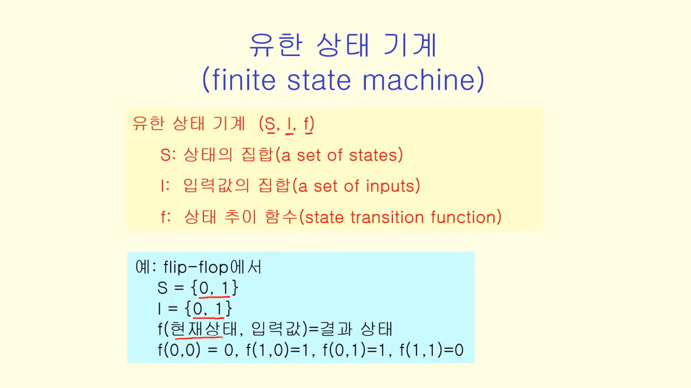

영상: https://www.youtube.com/playlist?list=PLD8rdlfZeJk7aDHa1VxqnX5TyQ4FmgavH


## 형식언어와 문법
### 형식언어

- 심벌 symbol - 기호
- 문자 alphabet - 기호들의 유한 집합
- 문자열 string - 알파벳에 포함된 기호들이 나열된 것
- 공문자열 empty string : 길이가 0인 문자열, λ

### 구-구문 문법 phase-structure grammer

- V: 기호의 집합
- T: 단말 기호
- S : 시작 기호
- P: 생성 규칙
  - if w ⇒w', w is replaced by w'


**정의** : L(G) 

```
문법 G를 사용해 만들어질 수 있는 문장들의 집합
```

### 문법의 종류


### 문법의 표현

- BNF(Backus-Naur Form) 형식

  - 비단말 기호는 <>로 표시

  - 생성 ⇒은 ::=로 표시

  - 하나의 비단말 기호로부터 생성되는 여러개 문자열은 |로 구분

- 문법 다이어그램
  - 비단말 기호는 사각형으로, 단말 기호는 원으로
  - 생성 과정은 화살표로 표시
    - 하나의 비단말 기호로부터 생성되는 여러개 문자열은 병렬로 놓고 화살표로 표시

- 유도 트리


## 정규식과 정규문법

정규 문법은 정규식으로 표현될 수 있음

정규 문법에 의해 생성된 언어는 정규식에 의해 만들어지는 정규 집합과 동일

### 표기법


## 유한상태기계


### 유한 상태 기계 유형

- 출력이 있는 유한 상태 기계

  - 출력이 있는 상태의 추이함수에 의해 결정

  - 출력이 상태에 의해 결정

- 출력이 없는 유한 상태 기계

  - 유한 상태 오토마타

- 등등

### 유한 상태 오토마타

출력이 없는 유한 상태 기계

- 출력 없고 최종 상태 집합 존재
- 언어를 인식하는 기계를 모델링할 때 사용


## 오토마타와 언어

<details>
    <summary>오토마타</summary>
    계산 능력이 있는 추상 기계와 그 기계를 이용해서 풀 수 있는 문제들을 연구하는 분야  
    형식 언어를 정의하는 관점에서 컴파일러에서 구분 분석을 하면서 추상 구문 트리를 생성할 때  
    계산 능력을 가진 추상 기계를 논하는 관점에서 계산 이론적으로 P-NP문제와도 연관성 있음
</details>


## 스트링 매칭 알고리즘

- 입력된 스트링에서 정해진 패턴을 찾는 문제

- 검색 혹은 파싱에 응용

### 오토마타 생성 알고리즘


## 셈(순열과 조합) - 곱의 법칙과 합의 법칙

셈은 어떤 event가 발생할 수 있는 경우의 수 계산

두개의 사건 E1, E2가 발생할 수 있는 경우의 수가 N1, N2일 때

- 두 사건이 연계돼 발생할 경우 → 곱의 법칙
- 두 사건이 서로 아무런 상관없이 별도로 발생할 경우 → 합의 법칙

### 곱의 법칙


### 합의 법칙


### 포함-배제 원리


