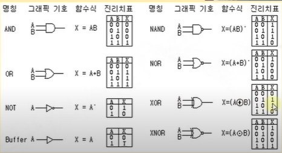
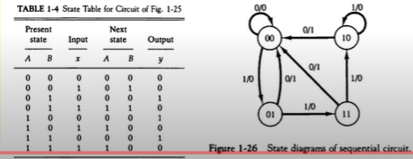

영상: [CSA2021 컴퓨터시스템구조](https://www.youtube.com/playlist?list=PLc8fQ-m7b1hCHTT7VH2oo0Ng7Et096dYc)

## [제 1장 Part-1](https://www.youtube.com/watch?v=SG89LOgT7Vc&list=PLc8fQ-m7b1hCHTT7VH2oo0Ng7Et096dYc&index=2)

### 디지털 컴퓨터(Digitial Computer)

- 정의
  - 이진 시스템을 사용해 계산을 수행하는 디지털 시스템
  - 비트의 그룹을 사용해 숫자, 문자 및 기타 정보를 표시하거나 처리

- 컴퓨터 하드웨어
  - CPU - 중앙처리장치. 컴퓨터 그 자체로 정의. 산술 논리 처리와 데이터의 저장, 제어 기능 수행
  - 주변장치 - 메모리(RAM/ROM), 저장장치(storage), 입출력 장치(IO devices)

- 컴퓨터 소프트웨어
  - 운영체제
    - OS - Operating System

  - 시스템 프로그램
    - 유틸리티, 데이터베이스, Editor
    - OS에 포함되거나 연결돼 시스템 운영을 보조

  - 응용프로그램

### 논리 게이트(Logic Gates)

### [부울 대수(Boolean Algebra)](/이산수학/명제,추론,귀납,부울대수.md)

사용이유

- 변수 사이 진리표 관계 대수적 표시
- 논리도 입출력 관계 대수 형식으로 표시
- 같은 기능 가진 더 간단한 회로 발견

### 맵의 간소화 (Karnaugh Map)
- [4강 동치 관계](/이산수학/이산수학-기초.md)

## [제 1장 Part-2](https://www.youtube.com/watch?v=gn5z3Un_qqM&list=PLc8fQ-m7b1hCHTT7VH2oo0Ng7Et096dYc&index=3)

### 조합회로 (Combinational Circuit)
- 정의
  - 입력과 출력을 가진 논리 게이트 집합
  - 출력값은 입력 0, 1 조합에 의해 결정되는 함수의 결과로 표시
  - n개의 입력조합이 있는 경우 가능한 입력 조합 : $2^n$가지
- 반가산기 - Half adder
  - 2개의 비트값을 산술적으로 가산
- 전가산기 - Full adder
  - 캐리값을 포함해 3비트 가산

### 플립플롭 (Flip-Flop)
- 정의
  - 1비트의 디지털 정보를 저장하는 이진 셀
  - 동기식 순차회로의 기본적인 요소로 사용, 조합회로와 함께 순차회로 구성
  - 입력 상태가 변화 일으키기 전까지는 이전 출력 상태 그대로 유지

- 플립플롭의 종류
  - SR-플립플롭
  - D-플립플롭
  - JK-플립플롭
  - T-플립플롭

- 모서리-변이형 플립플롭
  - 입력값 변화 모서리에서만 동작
    - Upward triggered FF : 입력값 0 → 1 일 경우에만 동작
    - Downward triggered FF : 입력값 1 → 0 일 경우에만 동작

  - 올바른 동작 위해선 최소 신호 유지 시간 필요
    - Setup time
      - 출력 변화를 위해 입력이 유지돼야 하는 최소시간

    - Hold time
      - 출력 유지 위해 입력이 바뀌지 않아야 하는 최소시간

### 순차회로 (Sequential Circuit)
- 정의
  - 플립플롭과 게이트(조합회로)를 서로 연결한 회로
  - 클럭펄스에 의해 동기화된 입력 순차에 의해 제어
  - 출력은 외부 입력과 플립플롭의 현 상태의 함수로 표시

- 플립플롭의 입력식
  - FF의 입력을 만들어내는 조합 회로 부분
  - 부울 수식에 의해 표현
  - 상태표, 상태도

