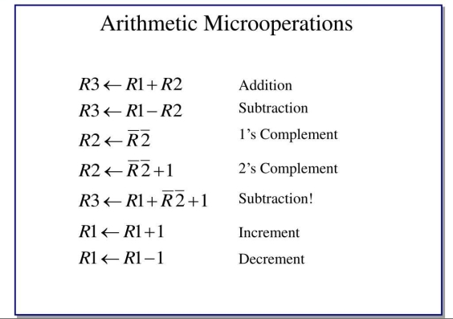
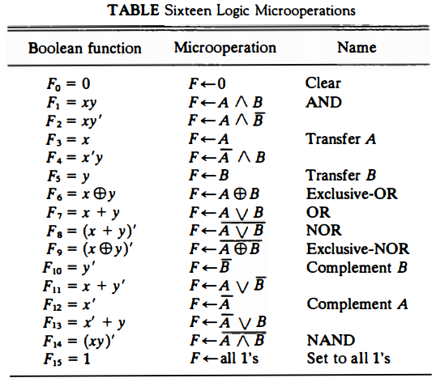

## [제 4장 Part-1](https://www.youtube.com/watch?v=LDjco5XJH1E&list=PLc8fQ-m7b1hCHTT7VH2oo0Ng7Et096dYc&index=8)

### 레지스터 전송 언어 (Register Transfer Language)

- 마이크로연산
  - 레지스터에 저장된 데이터를 가지고 실행되는 동작
  - 하나의 clock 시간 동안 실행되는 기본 동작 (Shift, count, clear, load, ...)

- 레지스터전송언어
  - 마이크로연산, 전송을 간단하고 명료하게 표시하기 위해 사용하는 기호
  - 디지털 컴퓨터의 내부 조직을 상세하게 나타내는 수단으로 사용
  - 디지털 시스템의 설계 편의성 제공

- 레지스터 전송 언어 규칙
  - 대문자로 표시
  - 레지스터 가장 왼쪽 FF → MSB(Most Significant Bit),  가장 오른쪽 → LSB(Least Significant Bit)
  - 16비트 PC 레지스터의 경우
    - 상위(8~15) : PC(H)
    - 하위(0~7) : PC(L)

### 레지스터 전송 (Register Transfer)

- 레지스터 정보 전송
  - 치환(replacement) 연산자
    - `R2 ← R1`

  - 제어 조건이 있을 경우, 
    - `If (P=1) then (R2 ← R1)`

  - 제어 함수로 표현할 경우,
    - `P: R2 ← R1`
    - R2에는 t+1 타이밍에 전송 완료

- 레지스터 전송의 기본 기호
  - Register data exchange
    - `T: R2 ← R1, R1 ← R2`

### 버스와 메모리 전송 (Bus and Memory Transfers)

- 공통 버스 (Common Bus)
  - 레지스터들 사이의 전송 통로
  - 한 번에 하나의 신호만 전송하도록 제어
  - 멀티플렉서를 사용해 레지스터 선택

- 3-상태 버터 (3-state Buffer)
  - 멀티플렉서 대신 사용해 버스 구성 가능
  - 3개의 상태로 종작
    - 논리 0, 논리 1 : 정상적인 버퍼로 동작
    - 고저항 상태 : 출력 차단

- 메모리 전송
  - Read: DR ← M[AR]
  - Write: M[AR] ← R1

## [제 4장 Part-2](https://www.youtube.com/watch?v=IUapFpDKhKI&list=PLc8fQ-m7b1hCHTT7VH2oo0Ng7Et096dYc&index=9)

### 산술 마이크로 연산 (Arithmetic Micro-operations)

- 마이크로 연산의 분류

  - 레지스터 전송 마이크로 연산 : 레지스터간 이진 정보 전송
  - 산술 마이크로 연산 : 수치 데이터에 대한 산술 연산
  - 논리 마이크로 연산 : 비수치 데이터에 대한 비트 조작 연산
  - 시프트 마이크로 연산 : 데이터에 대한 시프트 연산

- 산술 마이크로 연산

  

- 이진 가산기

  - 두 비트와 이진 캐리의 산술합을 계산
  - 여러 개의 전가산기를 연결

- 이진 감가산기

  - 보수를 만드는 게이트와 신호 사용
    - M→0 : 가산
    - M→1 : 감산

  - A(0-3), B(0-3), S(0-3)는 bus에 연결

### 논리 마이크로 연산 (Logic Micro-operations)

### 시프트 마이크로 연산 (Shift Micro-operations)

- 논리 시프트
  - 직렬 입력으로 0이 전송
  - R1 ← shl(R1)
  - R2← shr(R2)

- 순환 시프트
  - 직렬 출력이 직렬 입력으로 전송
  - cir, cil

- 산술 시프트
  - 부포 비트를 제외하고 시프트
  - 왼쪽 시프트 : x2
  - 오른쪽 시프트 : /2

- 산술 논리 시프트 장치 (Arthmetic-Logic Shift Unit)