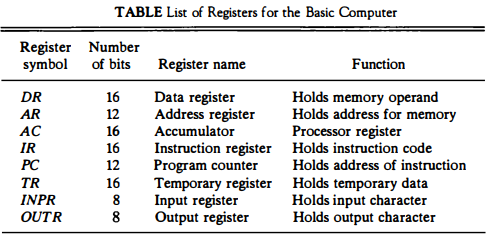

## [제 5장 Part-1-1](https://www.youtube.com/watch?v=vSnpYzCuwVY&list=PLc8fQ-m7b1hCHTT7VH2oo0Ng7Et096dYc&index=10)

### 명령어 코드 (Instruction Codes)

- 컴퓨터의 동작
  - 레지스터 내에 저장된 데이터에 대하 마이크로 연산의 시퀀스에 의해 정의
  - 범용 컴퓨터 시스템에서는 다양한 마이크로 연산 시퀀스를 정의

- 명령어 코드
  - 컴퓨터에게 어떤 특별한 동작을 수행할 것을 알리는 비트들의 집합
  - 연산 코드들로 구성

- 컴퓨터 명령어
  - 컴퓨터에 대한 일련의 마이크로 연산을 기술
  - 이진 코드로 구성
  - 데이터와 함께 메모리에 저장

- 프로그램
  - 사용자가 원하는 연산과 피연산자가 처리되는 순서를 처리되는 순서를 기술한 컴퓨터 명령어의 집합
  - 명령어 처리 과정을 제어

- 내장 프로그램
  - 제어 신호에 의해 명령어의 이진 코드를 해석해 실행
  - 명령어를 저장해 실행하는 컴퓨터 구동 방식

- 저장(내장) 프로그램 구조
  - 명령어의 집합으로 구성
  - 각 명령어는 명령어 포맷에 따라서 정의
  - 프로그램 실행부분에 따라서 메모리의 다른 부분에 저장
  - 명령어 실행 결과는 AC에 저장
- 간접주소 시스템
  - 많은 경우, 직접주소를 사용해 데이터 지정
  - 필요한 경우, 간접주소로 데이터 지정

### 컴퓨터 레지스터 (Computer Registers)

- 기본 컴퓨터의 레지스터
  - 기본컴퓨터 : DEC PDP-11 Mini Computer

- 기본 컴퓨터 레지스터 종류

- 버스 시스템의 종류
  - 내부 버스 : CPU 내부 레지스터간 연결
  - 외부 버스 : CPU 내부 레지스터 - 메모리간 연결
  - 입출력 버스 : CPU ←→ 주변장치(I/O) 연결
- 공통 버스 시스템
  - 내부 버스를 통칭
  - 내부 버스의 크기(Width)로 CPU 워드 크기 결정
    - 16bit 컴퓨터 - 내부 버스/레지스터 크기가 16bit
    - 32bit 컴퓨터 - 내부 버스/레지스터 크기가 32bit
  - 전송 연결 통로
    - 레지스터-레지스터 데이터 전송 통로
    - 레지스터-메모리 데이터 전송 통로(예외적 표현)
    - 한 순간에는 하나의 전송 신호만이 버스에 존재 가능

## [제 5장 Part-1-2](https://www.youtube.com/watch?v=T2oKxvinK84&list=PLc8fQ-m7b1hCHTT7VH2oo0Ng7Et096dYc&index=11)

### 컴퓨터 명령어 (Computer Instructions)

- 기본 컴퓨터 명령어의 종류
  - MRI 명령 7가지
  - PRI 명령 12가지
  - IO 명령 6가지

### 타이밍과 제어 (Timing and Control)

- 

### 명령어 사이클 (Instruction Cycle)

- 

### 메모리 참조 명령어 (Memory-Reference Instuctions)

-
